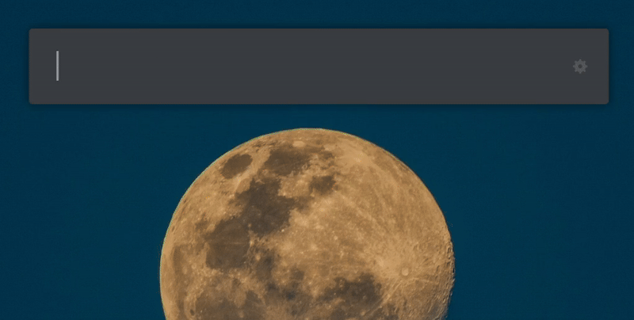

  

<h1 align="center">Shortn</h1>

[![Python Versions](https://img.shields.io/badge/python-3.6%20%7C%203.7%20%7C%203.8%20%7C%203.9%20%7C%203.10%20%7C%203.11%20%7C%203.12-%23007ec6?logo=data:image/svg+xml;base64,PHN2ZyB4bWxucz0iaHR0cDovL3d3dy53My5vcmcvMjAwMC9zdmciIHZpZXdCb3g9IjAgMCAxMDAgMTAwIj4gIDxkZWZzPiAgICA8bGluZWFyR3JhZGllbnQgaWQ9InB5WWVsbG93IiBncmFkaWVudFRyYW5zZm9ybT0icm90YXRlKDQ1KSI+ICAgICAgPHN0b3Agc3RvcC1jb2xvcj0iI2ZlNSIgb2Zmc2V0PSIwLjYiLz4gICAgICA8c3RvcCBzdG9wLWNvbG9yPSIjZGExIiBvZmZzZXQ9IjEiLz4gICAgPC9saW5lYXJHcmFkaWVudD4gICAgPGxpbmVhckdyYWRpZW50IGlkPSJweUJsdWUiIGdyYWRpZW50VHJhbnNmb3JtPSJyb3RhdGUoNDUpIj4gICAgICA8c3RvcCBzdG9wLWNvbG9yPSIjNjlmIiBvZmZzZXQ9IjAuNCIvPiAgICAgIDxzdG9wIHN0b3AtY29sb3I9IiM0NjgiIG9mZnNldD0iMSIvPiAgICA8L2xpbmVhckdyYWRpZW50PiAgPC9kZWZzPiAgPHBhdGggZD0iTTI3LDE2YzAtNyw5LTEzLDI0LTEzYzE1LDAsMjMsNiwyMywxM2wwLDIyYzAsNy01LDEyLTExLDEybC0yNCwwYy04LDAtMTQsNi0xNCwxNWwwLDEwbC05LDBjLTgsMC0xMy05LTEzLTI0YzAtMTQsNS0yMywxMy0yM2wzNSwwbDAtM2wtMjQsMGwwLTlsMCwweiBNODgsNTB2MSIgZmlsbD0idXJsKCNweUJsdWUpIi8+ICA8cGF0aCBkPSJNNzQsODdjMCw3LTgsMTMtMjMsMTNjLTE1LDAtMjQtNi0yNC0xM2wwLTIyYzAtNyw2LTEyLDEyLTEybDI0LDBjOCwwLDE0LTcsMTQtMTVsMC0xMGw5LDBjNywwLDEzLDksMTMsMjNjMCwxNS02LDI0LTEzLDI0bC0zNSwwbDAsM2wyMywwbDAsOWwwLDB6IE0xNDAsNTB2MSIgZmlsbD0idXJsKCNweVllbGxvdykiLz4gIDxjaXJjbGUgcj0iNCIgY3g9IjY0IiBjeT0iODgiIGZpbGw9IiNGRkYiLz4gIDxjaXJjbGUgcj0iNCIgY3g9IjM3IiBjeT0iMTUiIGZpbGw9IiNGRkYiLz48L3N2Zz4=)](https://www.python.org/)

`Shortn Extension` is a [ULauncher](https://ulauncher.io/) extension that shortens URLs with the option of customize it and get detailed statistics. Enhance your URL management with ease and efficiency.

`Why would you use it?`🤔  Take a look at this link: https://is.gd/GizaPyramids Just imagine, this shortened link replaced a hefty `450`-character URL! -btw It's the location of the Giza Pyramids on google maps 😍- It's all about convenience and efficiency."

## Demo

## Features

- `URL Shortening`: Quickly shorten URLs for easy sharing.
- `Custom URLs`: Customize your short URLs to make them more memorable.
- `Statistics`: Retrieve detailed statistics about your shortened URLs.
  - how many `times` the link was accessed on a given day.
  - what `pages` referred people to the link.
  - what `browser` visitors were using

## Installation
Open `Ulauncher` go to `Extensions` > `Add extension` and paste https://github.com/PyMustafa/ulauncher-shortn

## Usage

1. Open Ulauncher.
2. Type your keyword (`url` is the defualt) followed by the URL you want to shorten.
3. Optionally,
   - specify a custom short URL.
   - add `stats` at the end to get statistics page for your URL.

### Examples

- `url google.com` - Shorten google.com.
- `url google.com stats` - Shorten google.com and get statistics.
- `url google.com mycustomurl` - Shorten google.com with a custom short URL.
- `url google.com mycustomurl stats` - Shorten google.com with a custom short URL and get statistics.

## Development

To contribute to the development of this extension:

1. Fork the repository.
2. Create a new branch for your feature or bugfix.
3. Make your changes and commit them.
4. Push your changes to your fork.
5. Create a pull request with a detailed description of your changes.

## License

This project is licensed under the MIT License. See the [LICENSE](LICENSE) file for details.

## Acknowledgements

- [is.gd](https://is.gd) For their great API.
- [Freepik](https://www.freepik.com) For their awesome icons on [Flaticon](https://www.flaticon.com)

## Contact

For any questions or suggestions, feel free to open an issue or contact me at [developer.mustafa@outlook.com](mailto:developer.mustafa@outlook.com).

---
